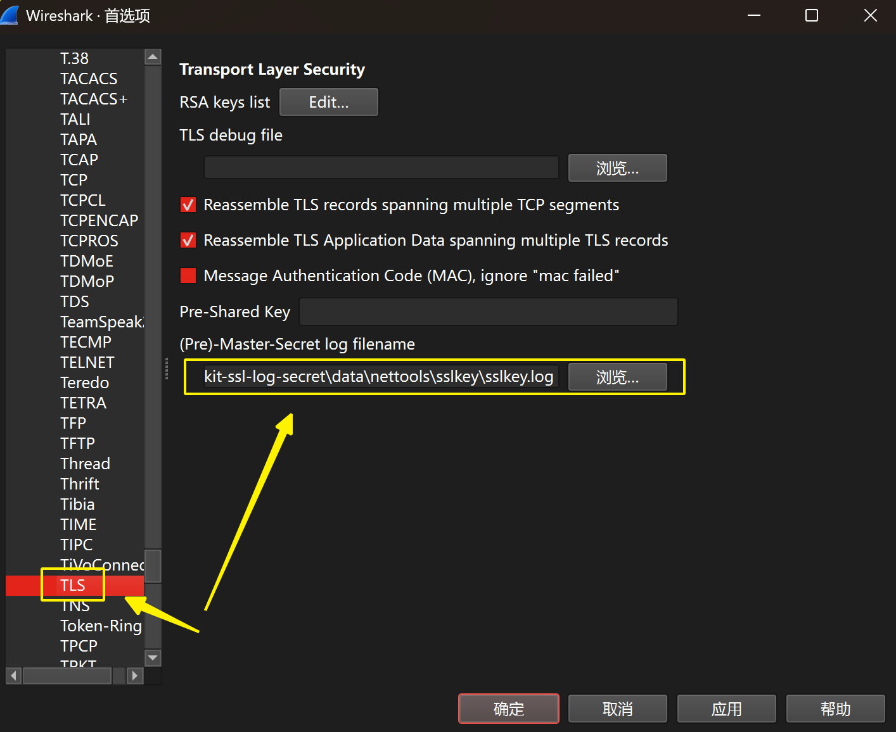
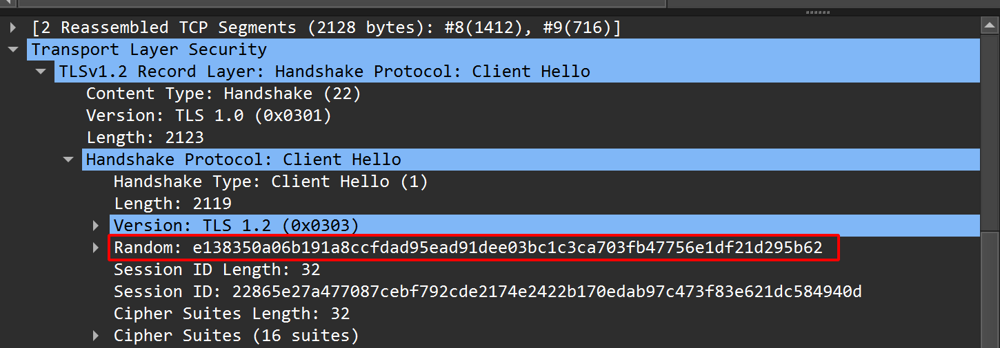
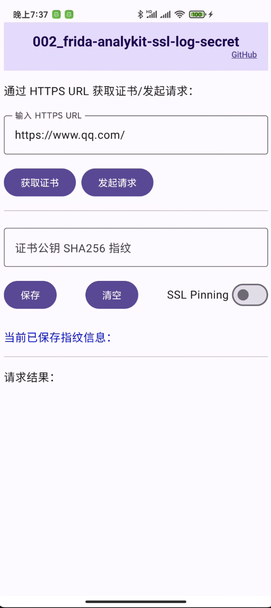
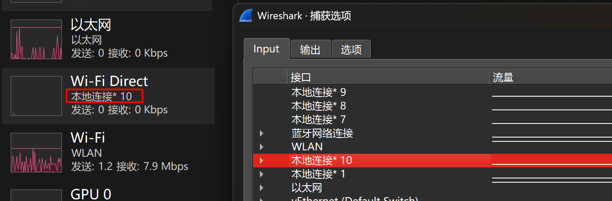
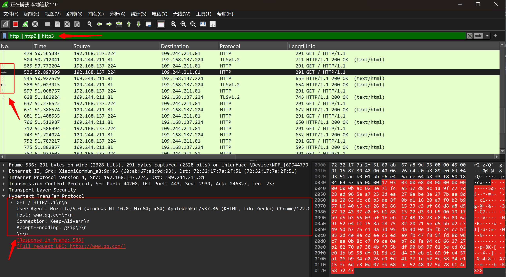
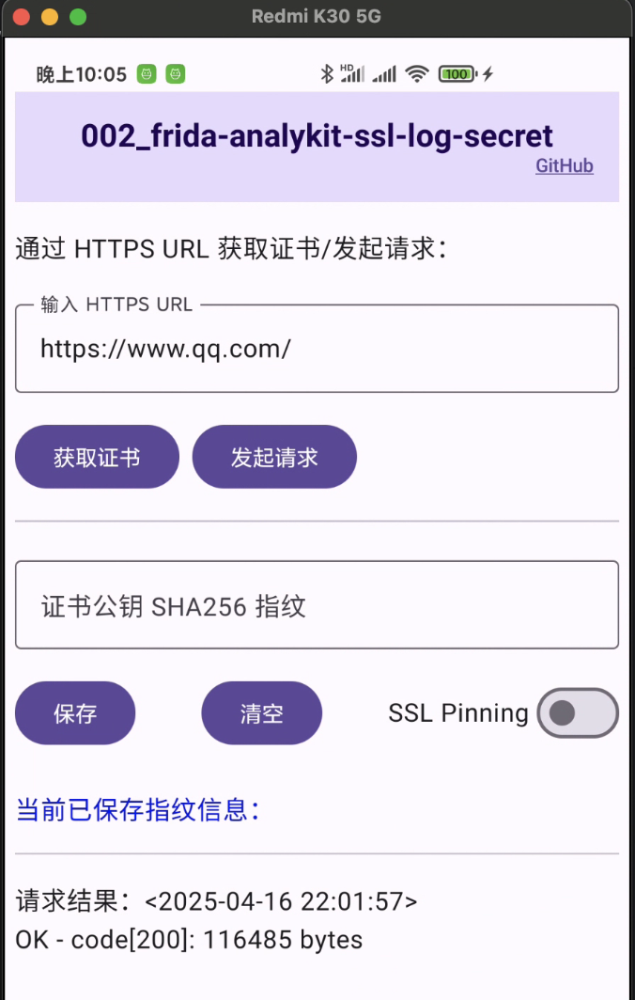
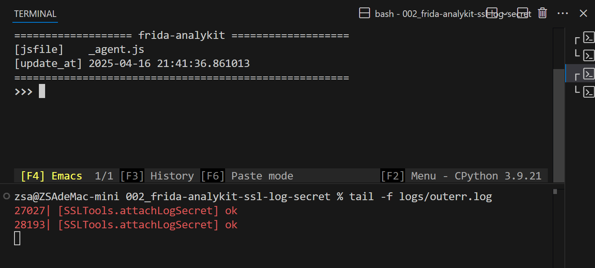
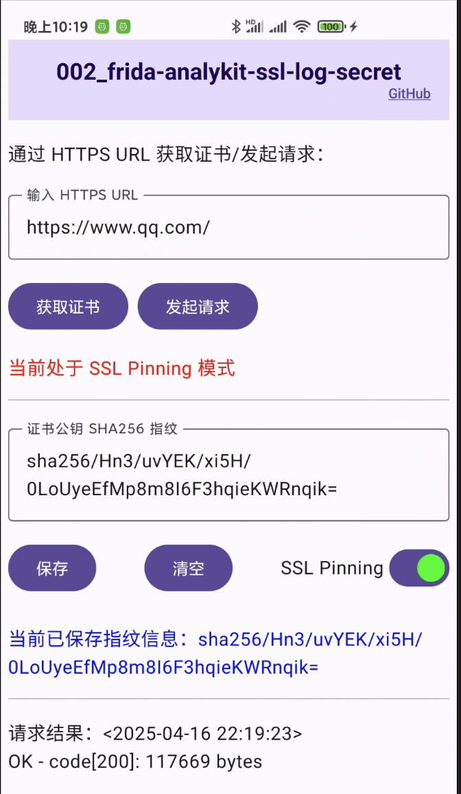
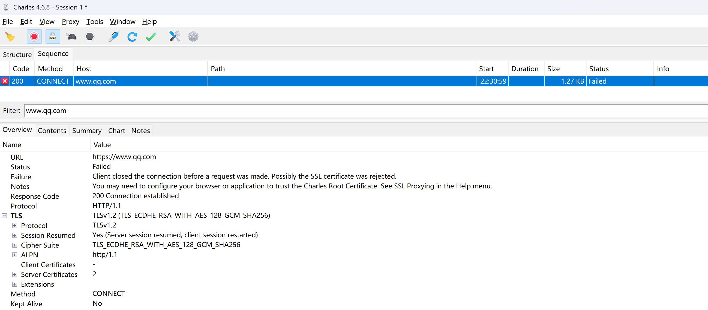
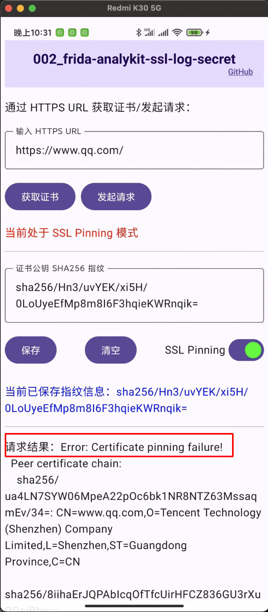

# frida-analykit + wireshark 流量抓包（上）

## 工具

- [frida-analykit](https://github.com/ZSA233/frida-analykit.git)
- [wireshark](https://www.wireshark.org/)
- [测试资源：002_frida-analykit-ssl-log-secret](https://github.com/ZSA233/android-reverse-examples/tree/main/002_frida-analykit-ssl-log-secret)

## 快捷跳转

- [字太多不看，跳转到演示直接看图](#测试)
- [上篇都小意思，跳转到下篇（占位）](#) 

## 前言

在Android上抓HTTPS包，我们会通常使用不限于charles, fiddler等工具作为中间人：
1. 在客户端的角度来看，中间人伪造ca来签发伪造的服务端证书跟app客户端通信。
2. 在服务端的角度来看，中间人作为app客户端发起请求。

在上面这些抓包工具的实现原理中，伪造证书这一点就是他们毕生无法绕过的坎，基于这个破绽就可以有下面的检测方式：
- 判断**在请求的时候获取到的服务端证书链中的leaf证书公钥指纹** 和 **真实的服务端leaf证书的公钥指纹（发版时候硬编码到app）** 是否吻合来确定是不是伪造来判断是否有中间人，这种方式就是我们所说的`ssl pinning`。

- 而mtls则是更严格的校验，服务端也要验客户端的证书（硬编码在app），就意味着你必须要用拥有服务端自签发的信任证书的客户端发起的访问，服务端才受理。既然这样，在中间人伪造了证书在没有配置信任客户端证书的情况下，请求会被拦在跟服务端握手时候的证书校验上。

对于常规的java层证书校验方式，如`TrustKit-Android`依赖的是Android框架层的Java TLS API（HttpsURLConnection、SSLSocket、X509TrustManager等），所以针对于这些证书校验，一些工具譬如`JustTrustMe`和`objection`，就是hook掉所有涉及到的常规证书校验的java层校验类来强制验证通过。

即便这些工具在java层已经hook了这么多方法，但是依然存在着会使用native层来进行证书校验的方式，存在魔改的http或者自定义协议的通信的方式，这些对于http协议的抓包工具来说都是束手无策的。

当然，其实前面说这么多，并不是为了贬低中间人代理类抓包工具，也不是为了争个高低对错，我只是想表达的是中间人代理这类抓包软件作为首选永远不会错，但是当你感到迷茫的时候，请不要忘记还有wireshark站在你的背后。

好了，屁话有点多了。进入正题，下面我会基于从目标出发，来说明如何在不使用中间人代理的方式让wireshark实时抓包并且自动解密tls。

**文章会分为上下两篇：**

- 上篇：讨论通过hook`libssl.so`来实现wireshark的实时tls解密
- 下篇：如何根据特征尝试自动hook静态链接了`boringssl`的.so库（webview和flutter）


## 现状

> wireshark是支持对用户提供的`sslkey.log`<sup>[图1](#图1)</sup>来解密对应匹配的tls流量，持续的写入sslkey.log，wireshark会使用类似于tail的方式读取新sslkey.

wireshark需要的sslkey.log包含的信息会是类似于下面这样：

```log
CLIENT_RANDOM 54235798f2aa3068370b4c30f97104f7176eeabc2feaaeff2087b81e7bed0154 878524cf02d4366eabbf8d520f86c98b334f3677e5858937e04b63f3b30722cbf20011e1a546edd1cf0f010aec60bcff
CLIENT_RANDOM f984d87e0ca21e979b1e6dfa3c70e4e8c502195249d8aba01d933fc96e020da4 2ba31e88d4f6df0d359f61a19b115de5b15324ad5c2362c4d14b38a34be8067c1bdd341f64f43aaa036d8863f49ffb04
CLIENT_HANDSHAKE_TRAFFIC_SECRET b4a5b243e816c0cb1364bcfc9a18ddf3de93bb1d4d7cafd60762bb6a377fdd42 4c2c8981b54a2a588b547ef7463e3aa5417e3c77de19030333913c5f35878be7cb08067b262ad6d306512f156560ac6d
SERVER_HANDSHAKE_TRAFFIC_SECRET b4a5b243e816c0cb1364bcfc9a18ddf3de93bb1d4d7cafd60762bb6a377fdd42 0096713b0c5ca4822f1ca3a4ab01f3b889a93f23b8603ae37fe73643f8b6ed31fe8a9e67e389a674578c91b50d146b21
```

每一行可以分成三段：
- `label`: 通常会有`CLIENT_RANDOM`, `CLIENT_HANDSHAKE_TRAFFIC_SECRET`, `EXPORTER_SECRET`等label，其中最关键的是 `CLIENT_RANDOM`。
- `Client Random`: 32字节（64个hex字符），握手阶段（Cient Hello）客户端发起Hello时候的随机数<sup>[图2](#图2)</sup>，这个值也是wireshark用来定位要解密tls报文的ID
- `Master Secret`: 48字节（96个hex字符），TLS 握手计算出来的主密钥。简单的可以理解成这是用于生成后续客户端和服务端通信的加密数据的密钥的重要参数。( 可以理解成`gen_data_secret(master_secret)` )

    
    <a name="图1">图1</a>

    <a name="图2">图2</a>


有了前面这些认识，再次确认我们需要完成的目标：**通过任何可行的方式，让要抓包的app上tls流量的sslkey实时写出到pc日志文件上，以让wireshark能够读取解密tls流量。**


## 如何获取sslkey.log

> 在Android 7之后，aosp的ssl就从openssl换到了boringssl，所以这里我们只会从boringssl项目来研究（虽然我们需要关注的地方大概率并没有区别）。
> 
> boringssl项目: https://github.com/google/boringssl

在aosp中boringssl会生成`libssl.so`，是java层SSLSocket / SSLContext等的native支持。**这是一句没有提供任何依据的结论描述**。对于没有了解过java层是怎么和native关联起来的人来说，这其实很依赖死记硬背，虽然了解这些并这不是必要的，但如果感兴趣的可以看：下面我会以一个不知道这个事实的角度来，从一个简单的例子中跟踪为什么java层定位到libssl.so。（如果已经了解或并不在意，可省略该部分[跳转](#ssl_log_secret)）

### 为什么是libssl.so？
```java
// java例子
URL url = new URL("https://example.com");
URLConnection conn = url.openConnection();
conn.connect()

// 跟踪步骤
java.net.URL.openConnection()
    v
    abstract URLStreamHandler
        ├── com.android.okhttp.HttpsHandler.openConnection()
        ├── com.android.okhttp.HttpHandler.openConnection()
        ├── com.android.okhttp.HttpHandler.newOkUrlFactory()
        ├── com.android.okhttp.OkUrlFactory.open()
        ├── com.squareup.okhttp.internal.huc.HttpsURLConnectionImpl()
        ├── com.squareup.okhttp.internal.huc.DelegatingHttpsURLConnection()
        ├── com.squareup.okhttp.internal.huc.HttpURLConnectionImpl()
        v
    abstract URLConnection
    v
com.squareup.okhttp.internal.huc.HttpURLConnectionImpl.connect()
    v
com.squareup.okhttp.internal.huc.HttpURLConnectionImpl.execute()
    v
com.squareup.okhttp.internal.http.HttpEngine.sendRequest()
    v
com.squareup.okhttp.internal.http.HttpEngine.connect()
    v
com.squareup.okhttp.internal.http.StreamAllocation.newStream()
    v
com.squareup.okhttp.internal.http.StreamAllocation.findHealthyConnection()
    v
com.squareup.okhttp.internal.http.StreamAllocation.findConnection()
    v
com.squareup.okhttp.internal.io.RealConnection()
    v
com.squareup.okhttp.internal.io.RealConnection.connect()
    v
com.squareup.okhttp.internal.io.RealConnection.connectSocket()
    v
com.squareup.okhttp.internal.io.RealConnection.connectTls()
    v
    abstract SSLSocketFactory
        ├── org.conscrypt.OpenSSLSocketFactoryImpl.createSocket()
        ├── org.conscrypt.Platform.createFileDescriptorSocket()
        ├── org.conscrypt.ConscryptFileDescriptorSocket()
        ├── org.conscrypt.newSsl()
        ├── org.conscrypt.NativeSsl.newInstance()
        ├── org.conscrypt.NativeCrypto.SSL_new()  // native
        v
    static native long SSL_new(long ssl_ctx, AbstractSessionContext holder) throws SSLException;
    v
    // 到达native函数，找到注册native的地方：
    v
com.android.org.conscrypt.NativeCryptoJni.init() // external/conscrypt/common/src/main/java/org/conscrypt/NativeCrypto.java
    v
    System.loadLibrary("javacrypto") // => libjavacrypto.so
        ├── // external/conscrypt/Android.bp：编译libjavacrypto.so的配置
        |   cc_defaults {
        |       name: "libjavacrypto-defaults",
        |     
        |       cflags: [
        |           "-Wall",
        |           "-Wextra",
        |           "-Werror",
        |           "-Wunused",
        |           "-fvisibility=hidden",
        |       ],
        |  
        |       srcs: ["common/src/jni/main/cpp/**/*.cc"],
        |       local_include_dirs: ["common/src/jni/main/include"],
        |   }
        |     
        |   cc_library_shared {
        |       name: "libjavacrypto",
        |       // ...
        |       shared_libs: [
        |           "libcrypto",
        |           "liblog",
        |           "libssl", // libjavacrypto.so依赖libssl.so
        |       ],
        |       // ...
        |       apex_available: [
        |           "com.android.conscrypt",
        |           "test_com.android.conscrypt",
        |       ],
        |       // ...
        |   }
        |  
        ├── // external/conscrypt/common/src/jni/main/cpp/conscrypt/jniload.cc
        |   jint libconscrypt_JNI_OnLoad(JavaVM* vm, void*) // 注册native方法, NativeCrypto_{libssl.exports}
        |   
        ├── // external/conscrypt/common/src/jni/main/cpp/conscrypt/native_crypto.cc
        |   NativeCrypto::registerNativeMethods(env);
        |       ├── ...
        |       ├── CONSCRYPT_NATIVE_METHOD(SSL_new, "(J" REF_SSL_CTX ")J")
        |       ├── ...
        |   static jlong NativeCrypto_SSL_new(JNIEnv* env, jclass, jlong ssl_ctx_address, CONSCRYPT_UNUSED jobject holder)
        |       ├── SSL_new() // #include <openssl/ssl.h>
        |
        ├── // external/conscrypt/common/src/jni/main/cpp/conscrypt/jniutil.cc 
        |   void jniRegisterNativeMethods(JNIEnv* env, const char* className, const JNINativeMethod* gMethods, int numMethods)
        |   env->RegisterNatives()  
        v
    static native long SSL_new(long ssl_ctx, AbstractSessionContext holder) throws SSLException;
    v    
........
(end)

// 以上，已经从 **java层** 一直跟踪到 **native层**，并且最后定位到 **libssl.so**，从而是可以确定事实：
//      `libssl.so`是java层SSLSocket / SSLContext等类的native支持.
```


### ssl_log_secret

> 为什么是这个方法？
> 1. 因为这函数原本就是项目为了方便调试和抓包分析用的，其生成的信息`(const char *)out`就是前面wireshark的解密所需。
> 2. 这个方法有容易定位的特征（CLIENT_RANDOM，这里简单剧透一下，下篇会具体利用）

下面的代码段来自 boringssl项目的`src/ssl/ssl_lib.cc`文件
```cpp
int ssl_log_secret(const SSL *ssl, const char *label, const uint8_t *secret,
                   size_t secret_len) {
  // 如果没有注册callback就不做处理
  if (ssl->ctx->keylog_callback == NULL) {
    return 1;
  }

  // 编码random 和 master_secret成字符串
  ScopedCBB cbb;
  uint8_t *out;
  size_t out_len;
  if (!CBB_init(cbb.get(), strlen(label) + 1 + SSL3_RANDOM_SIZE * 2 + 1 +
                          secret_len * 2 + 1) ||
      !CBB_add_bytes(cbb.get(), (const uint8_t *)label, strlen(label)) ||
      !CBB_add_bytes(cbb.get(), (const uint8_t *)" ", 1) ||
      !cbb_add_hex(cbb.get(), ssl->s3->client_random, SSL3_RANDOM_SIZE) ||
      !CBB_add_bytes(cbb.get(), (const uint8_t *)" ", 1) ||
      !cbb_add_hex(cbb.get(), secret, secret_len) ||
      !CBB_add_u8(cbb.get(), 0 /* NUL */) ||
      !CBB_finish(cbb.get(), &out, &out_len)) {
    return 0;
  }

  // 通知回调函数
  ssl->ctx->keylog_callback(ssl, (const char *)out);
  OPENSSL_free(out);
  return 1;
}


struct ssl_ctx_st {
  // ...
  // keylog_callback, if not NULL, is the key logging callback. See
  // |SSL_CTX_set_keylog_callback|.
  void (*keylog_callback)(const SSL *ssl, const char *line) = nullptr;
  // ...
}

```

确定要hook的函数的时候，最先想到的可能会是：

- 可不可以直接hook `ssl_log_secret`符号？**不可以**

为什么呢？最快速确定就是通过readelf来确定符号名称是否存在，或者使用hex编辑器来搜索字符串来确定存在并且在.symtab段（事实上如果是使用ida pro的话，他能显示并不能反映符号的存在，因为他会依赖其他的信息手段来确定函数符号名）；elf是否能够保留`STB_LOCAL`函数符号究其根本在编译的时候就确定了，通过`external/boringssl/Android.bp`的配置也能确定这些事实。

- 使用`SSL_CTX_set_keylog_callback`来设置`ssl->ctx->keylog_callback`

```cpp
// src/include/openssl/base.h
#define OPENSSL_EXPORT __attribute__((visibility("default")))

// 声明导出符号
// src/include/openssl/ssl.h
OPENSSL_EXPORT void SSL_CTX_set_keylog_callback(
    SSL_CTX *ctx, void (*cb)(const SSL *ssl, const char *line));

// src/ssl/ssl_lib.cc
void SSL_CTX_set_keylog_callback(SSL_CTX *ctx,
                                 void (*cb)(const SSL *ssl, const char *line)) {
  ctx->keylog_callback = cb;
}

```

`SSL_CTX_set_keylog_callback`作为导出符号，自然获取其符号地址起来也是非常的简单，在这之前，我们需要拿到要注册回调函数的`SSL_CTX *ctx`才能够继续，这个要怎么办呢？

### SSL_new

> 前面我们在[跟踪java层到native层](#为什么是libsslso)中，可以看到建立连接，首先需要的是 `SSL_new`。

```cpp
// src/include/openssl/ssl.h
OPENSSL_EXPORT SSL *SSL_new(SSL_CTX *ctx);

// src/ssl/ssl_lib.cc
SSL *SSL_new(SSL_CTX *ctx) {
  if (ctx == nullptr) {
    OPENSSL_PUT_ERROR(SSL, SSL_R_NULL_SSL_CTX);
    return nullptr;
  }

  UniquePtr<SSL> ssl = MakeUnique<SSL>(ctx);
  // ...

  return ssl.release();
}

```

所以我们的策略是，通过attach符号`SSL_new`，使用参数`SSL_CTX* ctx`来使用符号`SSL_CTX_set_keylog_callback`进行注册回调函数。

```ts

// 下面的实现代码是为了方便理解使用frida的原生函数实现，frida-analykit的方法进行了一定程度的封装


// 保持对象引用，避免NativeCallback定义的原生函数被gc掉
const no_gc_list = []


setImmediate(() => {
    const libsslMod = Process.getModuleByName('libssl.so')
    const SSL_new = libsslMod.getExportByName('SSL_new')
    const SSL_CTX_set_keylog_callback = new NativeFunction(
        libsslMod.getExportByName('SSL_CTX_set_keylog_callback'),
        'void', ['pointer', 'pointer']
    )
    
    Interceptor.attach(SSL_new, {
        onEnter(args) {
            const ctx = args[0]
            this.ssl_ctx = ctx
        },
        onLeave(retval) {
            const ctx = this.ssl_ctx
            
            const SSL_CTX_keylog_callback = new NativeCallback((ssl: NativePointer, line: NativePointer) => {
                const str = line.readCString()
                if (str !== null) {
                    console.log(str)
                }
            }, 'void', ['pointer', 'pointer'])
            no_gc_list.push(SSL_CTX_keylog_callback)
            
            SSL_CTX_set_keylog_callback(ctx, SSL_CTX_keylog_callback)
        }
    })

})


```

到这里我们完成了对`libssl.so`中tls的密钥打印。但这就是所有了吗？不，还没有，wireshark还拿不到这些数据，我们还需要使用rpc来接管所有的sslkey。


## 如何使用rpc来传输给wireshark？

> frida提供了一套rpc的通信实现：允许脚本中使用rpc.exports来注册导出函数定义，并且使用send和recv来通信：(frida-analykit实现了这一套，按照[文档配置使用](#工具)即可)
> 
> frida-analykit的导出函数注册位于 `frida-analykit/script/rpc.ts`


```ts

// @types/frida-gum/index.d.ts 定义

declare namespace rpc {
    let exports: RpcExports;
}

interface RpcExports {
    [name: string]: AnyFunction;
}

declare function recv(callback: MessageCallback): MessageRecvOperation;

declare function recv(type: string, callback: MessageCallback): MessageRecvOperation;

interface MessageCallback {
    (message: any, data: ArrayBuffer | null): void;
}

interface MessageRecvOperation {
    wait(): void;
}

declare function send(message: any, data?: ArrayBuffer | number[] | null): void;

```

- 导出的函数可以在go, python, nodejs对应的sdk中引用，下面以python的文档说明：

> frida-analykit的python的rpc接受的数据代理实现位于 `frida-analykit/agent/rpc/resolver.py`

```py

class Script:
    # ...

    # 用于注册消息到达后的回调函数callback
    @overload
    def on(self, signal: Literal["message"], callback: ScriptMessageCallback) -> None: ...

    # rpc导出的函数：注意js注册的函数名在py中的名字不是完全对等的，会有名称转换
    #        [py] hello_world => [js] helloWorld
    # 也就是说，_下划线会被camelCase，可以通过class ScriptExportsSync: def __getattr__ 函数_to_camel_case看到这个事实。
    def exports(self) -> ScriptExportsSync: ...

    # ...


```

这一部分我只列举了实现原理依据，其余都是代码开发、项目组织层面的，这些我就不过多说了（真想理解看代码自己消化更高效）。实现细节可以跳转阅读[`frida-analykit`](#工具)

## 测试

> 光是第一眼看到有这么多文字，耐心就足以被削去一半。说到这些，其实我是更倾向于直接把演示测试这一段放到前头（先通过图片看看怎么个事，再决定要不要细看，毕竟大家时间都很宝贵），但是想了想这会使得文章的行文组织过于跳脱、突兀，所以作罢，仅留下一把跳伞用于定位。

**下面的资源都可以[跳转工具](#工具)下载，其中下面的`测试资源`都是相对于该目录下的**


- 安装测试包 **app-debug.apk** 或者自行从**app/** 下的源码编译）


<a name="图3">图3</a>

图3可以看到app的大概情况，接下来我们会演示验证下面两点：

1. 验证frida-analykit + wireshark是否能规避类似于ssl pinning的证书校验。（虽然从原理上是显而易见的，但是没有比能看到事实更让人感到安心的）

2. wireshark能够实时抓包解密tls到并且展示http协议。


- 设备连接pc上开"移动热点"，wireshark选取对应的"热点网卡"

> 在win上使用softAP方式开热点的通常会自动创建`Wi-Fi Direct`网卡，在`wireshark 捕获选项`中选择该网卡（通过任务管理器可以确定名称）
>
> 推荐使用这种方式来让设备进行捕获，不然会混杂其他设备过多的流量还需要写过滤规则


<a name="图4">图4</a>

- 拉取`frida-analykit`，并且[按照文档配置好环境](https://github.com/ZSA233/frida-analykit?tab=readme-ov-file#%E7%94%A8%E6%B3%95)，配置好yaml文件，bootup-server启动frida-server。
```yaml

app: com.frida_analykit.ssl_log_secret
jsfile: _agent.js

server:
  servername: /data/local/tmp/frida-server
  host: 127.0.0.1:6666
  device: 

agent:
  datadir: ./data/
  stdout: ./logs/outerr.log
  stderr: ./logs/outerr.log


script:
  nettools:
    # 要输出sslkey.log文件的路径，[图1]位置选择该文件
    ssl_log_secret: ./data/nettools/sslkey/

```

- `./ptpython_spawn.sh`来启动脚本`index.ts`

- 点击"发起请求"按钮，发起https请求，

> sslkey.log文件只会在有数据进来的时候才会创建，所以一般会在发起一次请求后才去按[图1](#图1)配置，当然你手动创建也不是不行

<a name="图5">图5</a>
<a name="图6">图6</a>
<a name="图7">图7</a>

图5可以看出报文已经成功解密，其中标注了三个框：上框=过滤规则（只保留http协议相关）；中框=关联报文（关联的请求和响应）；下框=报文内容。

从wireshark不是针对http协议的，所以用起来是没有charles,fiddler直观


- 对于开启ssl pinning的流量是否有效呢？点击“获取证书” - “保存” - 开启"SSL Pinning" - “发起请求”

<a name="图8">图8</a>


- 最后附有中间人代理的情况下，开启ssl pinning会出现的错误。

<a name="图9">图9</a>

<a name="图10">图10</a>

## 结尾

这篇主要是借用`libssl.so`这个有明显符号导出的boringssl进行hook,一个简单的例子来说明这一套流量抓包的流程和原理。

但是实战中会能这么简单如愿的hook到`ssl_log_secret`吗？答案是否定的，现实情况是，即便是常用的webview，用的都不是动态库`libssl.so`，而是自己静态链接了boringssl的，这就意味着除了常规的java层原生实现的证书校验外，其余的tls流量都无法解密，如果仅仅只是到这种程度，当然算不上可用。所以下篇会针对性的讨论我们该如何根据特征来对静态链接了boringssl（譬如flutter和webview），但没有导出符号的ssl_log_secret函数进行hook（实际上也适用于libssl.so）。
