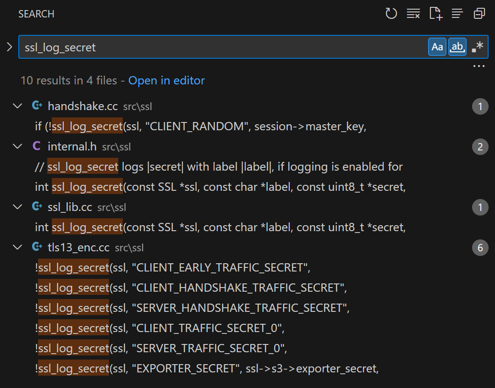
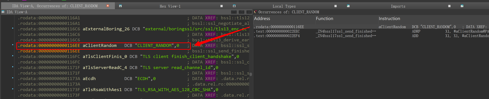
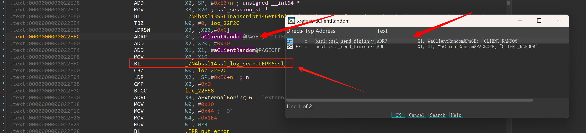
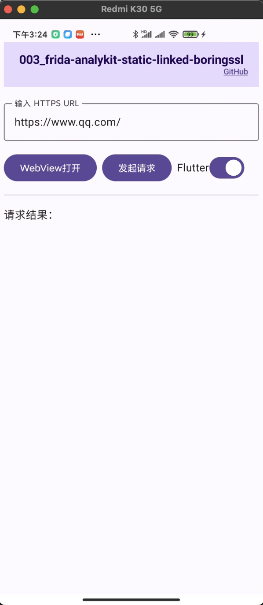
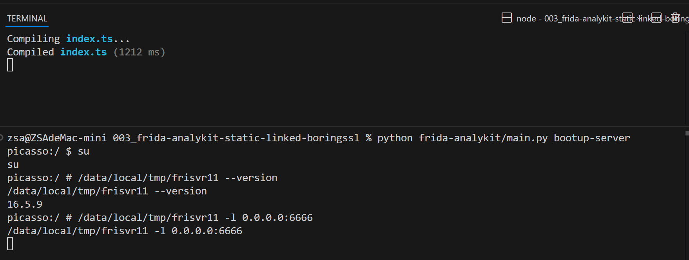
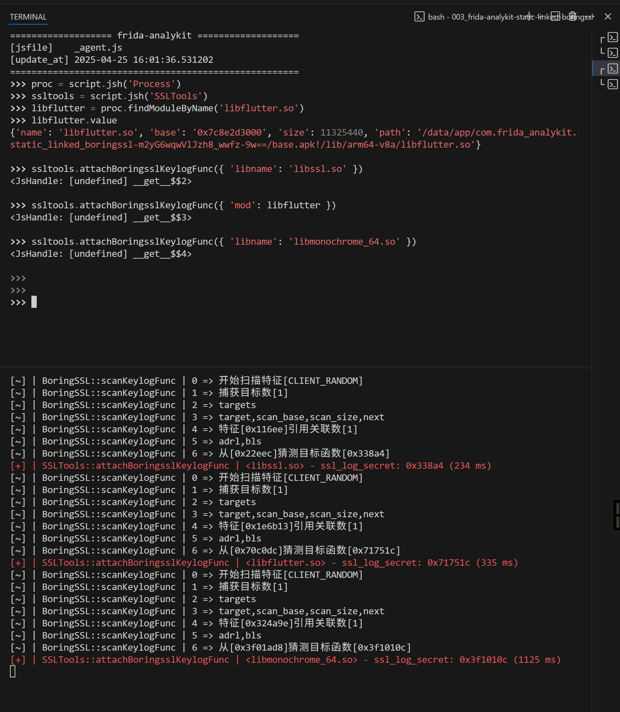
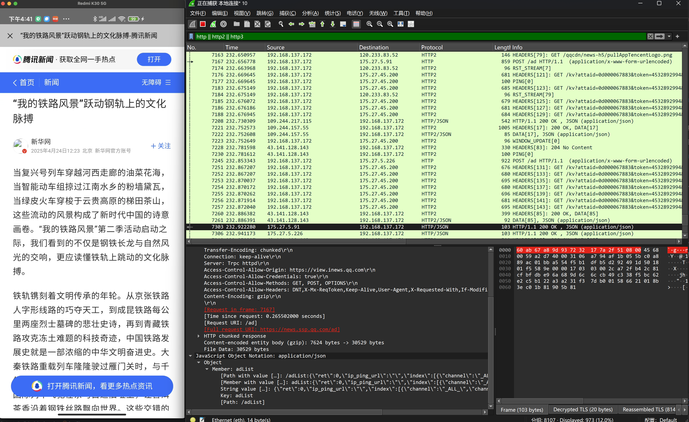
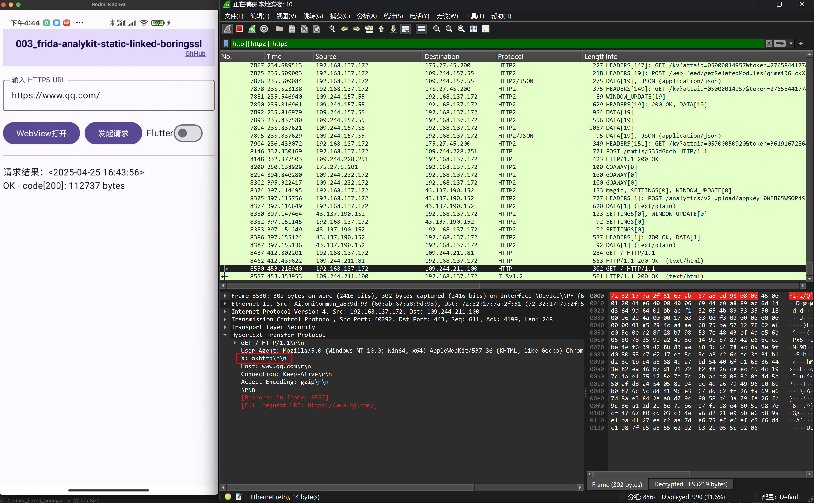

# frida-analykit + wireshark 流量抓包（下）- 通杀flutter和webview等常规静态链接boringssl的tls流量解密

## 工具

- [frida-analykit](https://github.com/ZSA233/frida-analykit.git)
- [wireshark](https://www.wireshark.org/)
- [测试资源：003_frida-analykit-static-linked-boringssl](https://github.com/ZSA233/android-reverse-examples/tree/main/003_frida-analykit-static-linked-boringssl)

## 快捷跳转

- [回上篇](../002_frida-analykit-ssl-log-secret/README.md) 


## 前言

**通杀**这种绝对的词都说得出来，妥妥的标题党！！！---- 对吗？对，但也不完全对。

在我"狡辩"之前，请允许我先简单的说一下这《下篇》所要达到的目标，或许你就能够理解我所说的对与不对的矛与盾。

这一篇文章的目标定为：

    根据`boringssl`的代码实现，通过分析`ssl_log_secret`函数的指令层**引用特征**来定位attach，以达到wireshark能够实时解密tls流量抓包。

**这一目标将作为这整篇文章的核心引导，如果你看迷糊忘了正在干什么，回想起来这一目标。** ----------- （要是我把目标这一存在也忘了你该如何应对？--- 从头开始 #doge ）


## ssl_log_secert有什么明显的特征引用？

> boringssl项目: https://boringssl.googlesource.com/boringssl


在项目中搜索`ssl_log_secret`关键词可以得到下面的[图1](#图1)结果:

<a name="图1">图1</a>

函数引用文件: `src/ssl/handshake.cc`

```cpp
bool ssl_send_finished(SSL_HANDSHAKE *hs) {
  // ...
  if (!ssl_log_secret(ssl, "CLIENT_RANDOM", session->master_key,
                      session->master_key_length)) {
    return 0;
  }
  // ...
}
```

**看到了吗？`CLIENT_RANDOM` 这个常量字符串将作为我们定位`ssl_log_secret`的入口。**


    在得到这个结论之前其实还需要考虑前提：ssl_send_finished是否在每一次握手都会调用？结论是的。但是关于这个过程不作为本文的讨论重点，所以我就此略过，下文中若出现类似我能够想到的看似理所当然但遍地前提的时候，我会使用括号标注说明存在需要考虑的前提.

尽管不应该写，但想了又想，我还是觉得这个<客户端握手流程的状态机循环流程>很有意思，所以就贴了出来：

```shell
state_start_connect
  └─ do_start_connect(hs)
      ├─ ssl_setup_key_shares(...)
      ├─ ssl_setup_extension_permutation(...)
      ├─ ssl_encrypt_client_hello(...)    # ECH 场景
      └─ ssl_add_client_hello(hs)         # 发送 ClientHello
state_read_server_hello
  └─ do_read_server_hello(hs)            # 解析 ServerHello
state_read_server_certificate
  └─ do_read_server_certificate(hs)      # 解析 Certificate
state_verify_server_certificate
  └─ do_verify_server_certificate(hs)    # 验证证书链
state_read_server_key_exchange
  └─ do_read_server_key_exchange(hs)     # 解析 ServerKeyExchange
state_read_server_hello_done
  └─ do_read_server_hello_done(hs)       # 解析 ServerHelloDone
state_send_client_certificate
  └─ do_send_client_certificate(hs)      # 发送 Certificate（若请求）
state_send_client_key_exchange
  └─ do_send_client_key_exchange(hs)     # 发送 ClientKeyExchange
state_send_client_certificate_verify
  └─ do_send_client_certificate_verify(hs) # 发送 CertificateVerify
state_send_client_finished
  └─ do_send_client_finished(hs)         # 发送 ChangeCipherSpec + Finished
        ├─ ssl->method->add_change_cipher_spec(ssl)
        ├─ tls1_change_cipher_state(hs, evp_aead_seal)
        └─ ssl_send_finished(hs)          # ★ 生成并加入 Finished 消息
state_finish_flight
  └─ do_finish_flight(hs)
state_read_session_ticket
  └─ do_read_session_ticket(hs)
state_process_change_cipher_spec
  └─ do_process_change_cipher_spec(hs)
state_read_server_finished
  └─ do_read_server_finished(hs)
state_finish_client_handshake
  └─ do_finish_client_handshake(hs)
state_done
  └─ 握手完成，返回 SSL_do_handshake() 成功

```

可以从这个状态机看出，这属于握手流程的一环。

## 从入口 CLIENT_RANDOM 定位到目标函数（手动）


下面我会使用ida pro来对一个`libssl.so`样本来进行讨论说明：在手动的情况下，我们是如何定位`ssl_log_secret`的，然后再根据原理来实现这一流程的自动化。
    
    这里的样本`libssl.so`只会分析在指令层的关联，不会依赖任何函数符号，选择这个elf单纯是因为足够简单，ida pro解析起来很快，而不是像webview的`libmonochrome_64.so`高达100多m，将耗费整个人生。

    肯定的是该分析不会过分针对libssl.so的特征来说明，而是会泛化拓展到webview和flutter等静态链接了boringssl的大部分常规项目。
    
    libssl.so的样本我会上传到资源路径`samples/`下，但是我建议使用自己测试机的libssl.so来进行分析，因为后续的实际hook偏移点是根据自己机器上的目标为准。


1. 搜索 `CLIENT_RANDOM` 字符串
> 依赖字符串搜索，意味着CLIENT_RANDOM必须明文存在于elf中（只要套一层编解码，那么这就是盾）

<a name="图2">图2</a>


2. `Xref`搜索引用该字符串的指令

<a name="图3">图3</a>

3. 该字符串作为函数的参数进行调用: 0x22efc => `BL #xxxxxx`，从而得到目标函数入口偏移 `0x338A4`

> 依赖BL来得到目标函数地址（只要使用blr Xn 来跳转同样是盾）


以上，就是我们手动能够得到的目标函数，简简单单的3步。


## 如何实现这些流程自动化？

> 虽说是要把流程自动化，当然也不至于把`ida pro`这么笨重的工具作为其中一环。所以下面的自动化流程都会使用纯frida脚本来实现，代码位于 `frida-analykit`


从上面再`ida pro`的手动3步流程中，可以提炼出核心步骤：搜特征字符串 -> 查找引用该字符串的指令 -> 分析引用指令接下来的call跳转确定函数入口

### 搜特征字符串

> `Memory.scan` 是`frida-gum`内实现的一个高效内存扫描方法，可以通过字节完全匹配/掩码匹配/正则匹配的方式来搜索内存。（底层实现在 [frida-gum](https://github.com/frida/frida-gum/blob/main/gum/gummemory.c#L347C1-L347C17)查看）

`CLIENT_RANDOM`这样一个固定的字符串，字节完全匹配模式能做到的同时也是这几种中最高效的方式，对于ascii长达十几个不相等的字节序列，能匹配到的结果通常不会太多。（这里面还可以优化：由于字符串这种常量值通常存在于`.rodata`段中，所以理论上还能缩小范围来扫描。）


下面贴的是`Memory.scan`和其`pattern`的文档说明，是异步方法，与之关联的还有`Memory.scanSync`这个同步实现。

```js
declare namespace Memory {
    /**
     * Scans memory for occurences of `pattern` in the memory range given by `address` and `size`.
     *
     * @param address Starting address to scan from.
     * @param size Number of bytes to scan.
     * @param pattern Match pattern, see `MatchPattern` for details.
     * @param callbacks Object with callbacks.
     */
    function scan(
        address: NativePointerValue,
        size: number | UInt64,
        pattern: string | MatchPattern,
        callbacks: MemoryScanCallbacks,
    ): Promise<void>;
  // ....
}

// tslint:disable:no-unnecessary-class
declare class MatchPattern {
    /**
     * Compiles a match pattern for use with e.g. `Memory.scan()`.
     *
     * @param pattern Match pattern of the form “13 37 ?? ff” to match 0x13 followed by 0x37 followed by any byte
     *                followed by 0xff, or “/Some\s*Pattern/” for matching a regular expression.
     *
     *                For more advanced matching it is also possible to specify an r2-style mask.
     *                The mask is bitwise AND-ed against both the needle and the haystack. To specify the mask append
     *                a `:` character after the needle, followed by the mask using the same syntax.
     *                For example: “13 37 13 37 : 1f ff ff f1”.
     *                For convenience it is also possible to specify nibble-level wildcards, like “?3 37 13 ?7”,
     *                which gets translated into masks behind the scenes.
     */
    constructor(pattern: string);
}

```


所以，我们可以写出下面这些方法来搜索特征字符串CLIENT_RANDOM:

```js
// CLIENT_RAND + \00     ： 字符串字节再加上一个 \00 eos终止符
const pattern = '43 4c 49 45 4e 54 5f 52 41 4e 44 4f 4d 00' 
const results = Memory.scanSync(module.base, module.size, pattern)

// results: { address: NativePointer, size: number }[]  所有满足pattern的匹配结果列表 

```


### 查找引用该字符串的指令

从指令的角度来考虑，想要在内存中引用一个地址，编译器可能会使用`adrp+add(adrl)`, `adr`, `ldr`, `movz/movk`等其中一种方式来对目标地址进行取值。

编译器既然是人写的，那么它总是有倾向性的，它总是希望能写出更高效更省空间的指令，综合其中`adrp+add`或许就是最常用的引用方式（或许你会问为什么不是`adr`，它明明就只有一条指令只占4个字节。没错，这确实这里面中最高效的指令，但是adr只能寻址~1M的偏移，而常量所在的`.rodata`和指令所在的`.text`通常是需要跨页的，能够满足1M的偏移的情况很少的），所以下面只会讨论基于`adrp+add`的组合方式来讨论。其中的adr在实际应用中可以考虑在内，但是作为`adrp+add`更值得作为本文所关注讨论的点。


#### 如何检索adrl指令？

> frida-gum 内置了[capstone](https://github.com/capstone-engine/capstone)反汇编引擎，使用`Instruction.parse`可以用来解析机器码和分析指令。

```js
declare class Instruction {
    /**
     * Parses the instruction at the `target` address in memory.
     *
     * Note that on 32-bit ARM this address must have its least significant bit
     * set to 0 for ARM functions, and 1 for Thumb functions. Frida takes care
     * of this detail for you if you get the address from a Frida API, for
     * example `Module.getExportByName()`.
     *
     * @param target Memory location containing instruction to parse.
     */
    static parse(
        target: NativePointerValue,
    ): Instruction | X86Instruction | ArmInstruction | Arm64Instruction | MipsInstruction;

    // ...
}

```

~~懂了，原来如此，通过遍历解析内存中的指令，我们不就能够定位找到引用了特征字符串的位置了吗？
--- **当然是可以的，但代价又是什么呢？#doge**  --- 代价就是这将花费相当长的时间进行指令的解析，虽然capstone非常高效，但是几兆的内存就足以花费几分钟来完成，这是不可以接受的。

~~我又懂了，既然前面说到的内存扫描方法非常的高效，那么我们能不能用前面扫内存的方式进行搜索呢？
--- **可以的兄弟，可以的。**


#### 怎么用内存扫描来检索指令？

> 指令既然存在于内存中，是0和1，那么其机器码自然会有其规范的编码方式。

我们要想在内存中扫描adrp指令，首先需要了解adrp指令的机器码每一位的作用(add指令我们这里就不贴了，因为在这里面不太需要理解add的机器码编码方式，因为既然adrp和add是成对出现组合成adrl的，那么只要能定位到adrp，后面的十几条，几十条甚至上百条指令逐条使用capstone来解析还是轻轻松松的)

- ADRP 编码方式

```shell
adr/adrp Xi, #{imm}
------------------------------------------------------------------
| 31  | 30 ─ 29 | 28 27 26 25 24 | 23 ──────────────── 5 | 4 ─ 0 |
| op  |  immlo  |    1 0 0 0 0   |     immhi (19b)       |  Rd   |
------------------------------------------------------------------
# op      : 0=adr; 1=adrp
# immlo   : #{imm}立即数最低 2 位
# 28-24   : (0b10000)固定位不变
# immhi   : #{imm}立即数高 19 位
# Rd      : 目的寄存器Xi

# (immhi:immlo)： 带符号的21位数
# imm = 目标页号 – PC页号

```

发现了吗，adrp指令的时候，这里面的bit31, bit28-bit24这6个位是固定的，我们是不是可以根据这个特征找到所有的疑似adrp指令？


前面我们再搜内存的时候提到的一种匹配方式：`掩码匹配`模式


- 什么是"掩码匹配"模式？

```shell
# adrp的固定6位设置后，得到下面这个二进制值的测试值（其十六进制是 0x90000000）
  28   24   20   16
   v    v    v    v
1001 0000 0000 0000
0000 0000 0000 0000
   ^    ^    ^    ^
  12    8    4    0

```


```sh
# 为了表示是哪6位，那么我们就用另一个值来表示，而这个就叫做掩码(下面的十六进制是 0x9F000000)
  28   24   20   16
   v    v    v    v
1001 1111 0000 0000
0000 0000 0000 0000
   ^    ^    ^    ^
  12    8    4    0

```

```sh
# 然后我们把上面两种信息值用":"组合起来，完成对要匹配的内存值的位描述：
00 00 00 90 : 00 00 00 9F
# (注意这里是小端表示)

# 这样的描述，是同时包含了：1)哪些位 2)是什么值
# 但是很奇怪，理论上第二段是表示掩码，也就是哪些位置我们是确定的，他一个字节中全都是0不就是表示了这些位的值都是不确定的吗，那不就是意味着任意值都行？
# 既然这样，没有意义的值我们去掉，那可以简化成:
90 : 9F

# 顺便一提实现这匹配的原理是：测试值 & 掩码 == 内存值 & 掩码
```

我们兴高采烈的把这个pattern丢给`Memory.scan`来搜索内存：代码一存，脚本一开，内存直接原地爆炸了。搜出来几十上百万的匹配结果。


这个pattern只有一个字节，满足的匹配太多了，回过头再来看看adrp的机器码编码编码方式，尝试限制条件来加入更多的已知位。

**Rd**：要存储页基址的寄存器，一定会用哪一个？我们不是很好预测。虽然CLIENT_RANDOM是传递给ssl_log_secret函数的第二个参数，按照aarch64架构参数传递的寄存器约定，通常会是X1。可实际上这是对于目标函数入口而言的，我们没法保证CLIENT_RANDOM是直接传递给目标函数，亦或者是先经过一层代理封装函数（这依赖于编译器的行为），再由封装函数调用到目标函数的。

**imm**：立即数，是一个页码差，当确定pc所在的页是确定的时候，页码差就是确定的。利用这点，我们约束自己所在的每一页都有自己的pattern，这样，就可以得到下面的pattern掩码

```sh
  28   24   20   16
   v    v    v    v
1111 1111 1111 1111
1111 1111 1110 0000
   ^    ^    ^    ^
  12    8    4    0

# 也就是说，只有Rd是无法确定的,掩码是： 
{测试值} : E0 FF FF FF

# 其中的测试值我们根据页码计算出来即可
```


按照上面这种分页搜索的pattern，是能最大程度的筛选出最少的结果。

#### 结合add筛选目标地址

前面我们通过adrp的机器码匹配到所有满足的`adrp指令`，这 加载出来的地址并不是目标地址，而只是一个页基址，也就是说adrp要引用的是目标地址中所有再同一页的其他地址都是有可能的，所以我们还要结合`add指令`把剩下的页偏移加上再进行比对。

基于上一步扫描出来的疑似目标地址的adrp指令，我们这个时候就可以进行下面的条件过滤：

1. 搜索出来的指令地址必须满足4字节对齐
2. `adrp Rd, #{imm}` 的下一条 `add Xd, Xd, #{imm1}`指令算出来的Xd目标必须等于目标地址


```js
const targetAddr: NativePointer // 特征字符串的目标地址
const MAX_GAP: number = 30 // adrp -> add 的最大间隙
let adrpResults: NativePointer[] // 所有可能的adrp指令(经过4字节对齐过滤)

let funcEntries: NativePointer[] = [] // 可能的目标函数入口

for (const code of adrpResults) {
    try {
        let insn = Instruction.parse(code) as Arm64Instruction
        if (insn.mnemonic !== 'adrp') {
            continue
        }
        const reg = insn.operands[0].value
        // 接下来解析到跳转目标
        let blInsn: Arm64Instruction | undefined
        let adrlTarget: NativePointer = ptr(insn.operands[1].value.toString())

        let foundAdd: boolean = false
        loop: for (let i = 0; i < MAX_GAP; i++) {
            insn = Instruction.parse(insn.next) as Arm64Instruction
            const ops = insn.operands
            switch (insn.mnemonic) {
                case 'add':
                    if (foundAdd) {
                        continue
                    }
                    if (ops[0].value !== reg) {
                        break
                    }
                    adrlTarget = adrlTarget.add(ops[2].value.toString())
                    if(!adrlTarget.equals(targetAddr)) {
                        // 引用的目标地址不一致
                        break loop
                    }
                    foundAdd = true
                    break
                case 'bl':
                    // 可能跳转到函数入口的call跳转
                    blInsn = insn as Arm64Instruction
                    break loop
            }
        }

        if (blInsn) {
            // 所有引用了CLIENT_RANDDOM字符串，的下一个函数调用
            funcEntries.push(ptr(blInsn.operands[0].value.toString()))
        }
    } catch (e) {

    }
}
```


### 匹配的目标函数入口

仔细观察上面的代码，我们在筛选出了满足目标地址的adrl地址的同时，还顺便解析了后续的bl函数调用指令来获取目标函数地址。（实践中，bl的目标并不意味着一定属于目标函数，这里面可能会先经过跳板或尾调函数后在跳转才到达的目标函数，所以需要考虑中间函数的判断处理）

## 代码实现和优化

通过上面，我们经过筛选和优化，如无意外的话，是能够得到包含了`ssl_log_secret`函数的目标地址了------ 吗？

**有可能，因为如果仅仅是通过上面的脚本，是有可能得出多个满足匹配要求的结果，因为不排除有多个匹配的字符串或多个引用字符串的指令。同时我们并没有针对于目标函数做什么校验，如果一定要加，根据特点我们或许是可以通过判断目标函数是否引用了strlen来计算目标函数是ssl_log_secret函数的置信度。但我不希望为了不确定的特殊场景加入过多的if else条件判断复杂化这个实现，因为能够得出少量的目标选择辅助让用户来自定义判断会更灵活，同时这也是frida-analykit的目标。**


前面的代码是试验用的原理实现雏形，并不实际应用，即便经过了优化，在实际应用中还是很慢，特别是当对webview的`libmonochrome_64.so`进行分析的时候，要花费将近一分钟。但是别怕，这里面还有进一步优化的空间：

1. 我们通过了按页对应的掩码pattern来匹配机器码是能利用的最严苛的掩码模式了，但是如果按照每一页4k来算，100多m的`libmonochrome_64.so`，这也是超过了25000页。
2. 每一页的扫描结果在js层进行筛选都要先经过js和c之间的上下文切换性能损耗

**上面两个点可以通过下面的实现来进行优化：**

1. 理论上adrp+add这种编码方式设计的立即数是能够寻址~±4G空间，但实际应用在一个elf中，他就不太可能占用这么大的内存，所以对于imm立即数，不管是（正值）正页差还是（负值）负页差，在区间内他就必然会存在固定的位，所以我们可以分开两个区间（正/负区间）：计算每个区间固定的imm高位用来筛选，这样我们就能从n复杂度的遍历页数内存扫描缩小到遍历常量2次内存扫描。[frida-analykit/script/elf/xref.ts](https://github.com/ZSA233/frida-analykit/blob/main/script/elf/xref.ts#L168)


2. 使用`CModule`嵌入c代码，对预匹配的结果用c直接进行筛选，避免经过上下文切换交由js过滤。 [frida-analykit/script/cmodule/scan_adrp.ts](https://github.com/ZSA233/frida-analykit/blob/main/script/cmodule/scan_adrp.ts#L6)

```c
#include <glib.h>
#include <gum/gummemory.h>
#include <gum/gumdefs.h>

#define PAGE_SIZE 0x1000
#define GET_ADDR_PAGE(x) ((uintptr_t)(x) & ~(PAGE_SIZE - 1))
#define ADRP_IMM_LEN_MASK 0x1fffff
#define ADRP_FIXED28_24_BITSET_MASK (0b10000 << 24)
#define ADRP_PAGE_INSTR_MASK 0x9fffffe0

typedef struct _MemoryScanRes MemoryScanRes;
typedef struct _ScanUserData ScanUserData;

static gboolean on_match_fuzzy_adrp(GumAddress address, gsize size, gpointer user_data);

struct _ScanUserData
{
    gpointer target_address;
    gint align_offset;
};


struct _MemoryScanRes 
{
    GArray *results;
    ScanUserData *user_data;
};

void _dispose(const MemoryScanRes *res)
{
    g_array_free(res->results, TRUE);
}

static gboolean on_match_fuzzy_adrp(GumAddress address, gsize size, gpointer user_data)
{
    MemoryScanRes *scan_res = (MemoryScanRes *)user_data;
    const guintptr target_page = (guintptr)GET_ADDR_PAGE(scan_res->user_data->target_address);
    const guintptr align_offset = (guintptr)scan_res->user_data->align_offset;
    const guintptr addr_val = (guintptr)address - align_offset;
    const gpointer pc_addr = (gpointer)addr_val;
    
    // 4字节指令对齐
    if ((addr_val & (sizeof(guint32) - 1)) != 0)
        return TRUE;
    
    // 按pc页差进行匹配
    const guintptr pc_page = (guintptr)GET_ADDR_PAGE(address);
    const guint32 page_delta = (guint32)((target_page - pc_page) >> 12) & ADRP_IMM_LEN_MASK;
    const guint32 immlo = page_delta & 0b11;
    const guint32 immhi = page_delta >> 2;
    const guint32 op = 0x1;
    const guint32 adrp_sign =
        (op << 31) | 
        (immlo << 29) | 
        ADRP_FIXED28_24_BITSET_MASK | 
        (immhi << 5);

    if (((*(guint32 *)pc_addr) & ADRP_PAGE_INSTR_MASK) != (adrp_sign & ADRP_PAGE_INSTR_MASK))
        return TRUE;

    g_array_append_val(scan_res->results, pc_addr);
    return TRUE;
}

gpointer scan(const GumAddress base_address,
               const gsize size,
               const gchar *pattern_str,
               MemoryScanRes *const scan_res)
{
    if (scan_res == NULL)
        return NULL;

    scan_res->results = g_array_new(FALSE, FALSE, sizeof(gpointer));

    const GumMemoryRange range = {base_address, size};
    const GumMatchPattern *pattern = gum_match_pattern_new_from_string(pattern_str);

    // Memory.scan的内部实现
    gum_memory_scan(&range, pattern, on_match_fuzzy_adrp, scan_res);

    return scan_res->results;
}


```

经过上面一轮优化后，100多m的`libmonochrome_64.so`的内存空间全范围扫描能控制在5s内，我认为这是在能容忍的范围。（优化前后有多大的差异可以尝试将[`AdrlXref.scanAdrl`](https://github.com/ZSA233/frida-analykit/blob/main/script/elf/xref.ts#L90)换成[`AdrlXref.scanAdrlSlow`](https://github.com/ZSA233/frida-analykit/blob/main/script/elf/xref.ts#L192)）


## 测试

> 上面叭叭叭说一大堆，已经等不及看实际的效果了

在测试验证阶段，我们点题回到`boringssl`来验证效果：[frida-analykit/blob/main/script/net/ssl.ts](https://github.com/ZSA233/frida-analykit/blob/main/script/net/ssl.ts#L122)


- 针对boringssl的三个常见的场景：`okhttp/flutter/webview` 写了一个测试样本[app-release.apk](https://github.com/ZSA233/android-reverse-examples/blob/main/003_frida-analykit-ssl-log-secret/samples/app-release.apk)（[app样本代码](https://github.com/ZSA233/android-reverse-examples/tree/main/003_frida-analykit-ssl-log-secret/app)）


<a name="图4">图4</a>

- 按照[frida-analykit](https://github.com/ZSA233/frida-analykit.git)文档安装分析工具

- 配置config.yml

```yml

# 样本app
app: com.frida_analykit.static_linked_boringssl
jsfile: _agent.js

server:
  servername: /data/local/tmp/frida-server
  host: 127.0.0.1:6666
  device: 

agent:
  datadir: ./data/
  stdout: ./logs/outerr.log
  stderr: ./logs/outerr.log


script:
  nettools:
    # sslkey写出文件目录
    ssl_log_secret: ./data/nettools/sslkey/

```

- `npm run watch`启动脚本变动编译

- `./ptpython_spawn.sh` 启动脚本注入app

<a name="图5">图5</a>


- 通过下面的流程体验attach的流程

> 我这里使用 REPL 来演示是为了更直观的演示注入的流程（在index.ts中写脚本找准时机注入也是没问题的）

```sh
# 下面`script.jsh()`是py用来指定代理js全局变量的方法
# py是通过JsHandle来实现持有js层中的代理变量

=================== frida-analykit ===================
[jsfile]    _agent.js
[update_at] 2025-04-25 16:01:36.531202
======================================================
# 获取js层的全局变量：Process
>>> proc = script.jsh('Process')
# 获取js层的全局变量：SSLTools
>>> ssltools = script.jsh('SSLTools')
# 调用 Process.findModuleByName('libflutter.so')，并把结果交由py的libssl变量代理
>>> libflutter = proc.findModuleByName('libflutter.so')
# 打印 libflutter 的值(需要注意的是这里面的序列化依赖frida的rpc的实现，任何不能JSON序列化的对象都会报错)
>>> libflutter.value
{'name': 'libflutter.so', 'base': '0x7c8e2d3000', 'size': 11325440, 'path': '/data/app/com.frida_analykit.static_linked_boringssl-m2yG6wqwVlJzh8_wwfz-9w==/base.apk!/lib/arm64-v8a/libflutter.so'}

# attach [libssl.so]的boringssl-ssl_log_secret
>>> ssltools.attachBoringsslKeylogFunc({ 'libname': 'libssl.so' })
<JsHandle: [undefined] __get__$$2>

# attach [libflutter.so]的boringssl-ssl_log_secret
>>> ssltools.attachBoringsslKeylogFunc({ 'mod': libflutter })
<JsHandle: [undefined] __get__$$3>

# 在 attach webview之前，需要点击 <Webview打开> 来首次加载webview的elf，否则会提示找不到so
>>> ssltools.attachBoringsslKeylogFunc({ 'libname': 'libmonochrome_64.so' })
<JsHandle: [undefined] __get__$$4>

# 之后就可以按照《上篇》流程将生成的sslkey.log导入到wireshark抓包了
```

<a name="图6">图6</a>

大家可以将对应的so库送入ida pro反编译来验证计算出来的偏移是否属于ssl_log_secret

- webview 流量的解密结果

<a name="图7">图7</a>

- flutter中http发起请求的流量解密结果

<a name="图8">图8</a>

- java层okhttp发起请求的流量解密结果（关闭"Flutter开关"即可切换）

<a name="图9">图9</a>


在[图8](#图8)和[图9](#图9)中的红框看到，为了区分`dart`和`okhttp`发起的请求，在headers中添加了x头标识


以上，完成了《下篇》的讨论。

## 结尾

让我们再回到前言所提到的：标题写着"通杀"，是标题党吗？----- 关于这个问题的答案，我觉得可以从两个角度中讨论：

1. 从追求客观事实的一个“我”来看：必须是标题党，做不到无懈可击，只要有任何一个反例、有任何一个破绽就算不上"通杀"。

2. 从追求阅读流量的一个“我”来看：不属于了吧？不对，当然也是属于标题党啦！我无法否认我追求严谨的角度，但是只要做出一些取舍就能够实现平衡共存或许是值得的。

## 接下来

好了，流量抓包的下篇补完了frida-analykit分析工具的ssltools部分。下一步看情况可能会考虑尝试：

1. 研究讨论在逆向中我们经常需要用到的dex-dump实现：虽说常规的内存扫描已经是足够傻瓜通用了，但是其过度依赖特征导致其从根本上是无法避免漏扫问题，那么能不能从更原理层面精准Dump出dex？

2. 研究讨论带elf壳的主elf分析思路：在这种带壳的elf的常规分析思路是都会尝试先脱壳再分析主elf，脱壳这一步通常需要研究壳elf繁琐绕口的dlopen加载实现。但如果能够获取足够多的辅助信息，带壳分析是不是可行的呢？

3. ...